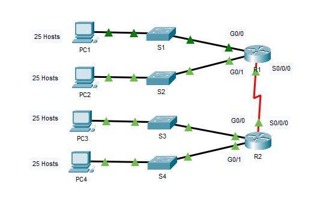

# Packet Tracer – IPv4 Subnetting Scenario

## Overview

This lab focuses on designing and implementing an IPv4 subnetting scheme using a fixed-length subnet mask (FLSM).  
The scenario requires dividing a /24 network into multiple subnets to support four LAN segments and one WAN link between routers.

## Objectives

- Design an IPv4 subnetting scheme
- Allocate IP addresses to routers, switches, and hosts
- Document the addressing plan
- Verify end-to-end connectivity
- Validate scalability and subnet efficiency

---

## Network Topology

---

## Requirements

- Four LAN segments
- One WAN link between R1 and R2
- Minimum 25 hosts per LAN
- Same subnet mask for all networks (FLSM)
- Structured and scalable addressing plan

---

## Address Space

- Base network: **192.168.100.0/24**

---

## Subnetting Decision

After evaluating host and subnet requirements:

- Required subnets: 5
- Borrowed bits: 3
- New prefix: **/27**
- Subnet mask: **255.255.255.224**
- Usable hosts per subnet: **30**
- Total subnets created: **8**

This design satisfies both current requirements and future growth.

---

## Detailed Documentation

- Subnet Calculations → [View subnet-design.md](./subnet-design.md)
- Addressing Table → [View addressing-table.md](./addressing-table.md)

---

## Implementation Summary

- First usable IP assigned to router interfaces
- Second usable IP assigned to switches (VLAN 1)
- Last usable IP assigned to hosts
- WAN link uses first usable for R1 and last usable for R2
- EIGRP pre-configured for dynamic routing

---

## Result

- All LAN segments properly segmented
- No overlapping networks
- Full Layer 3 connectivity verified
- Structured enterprise-style IPv4 design

---
